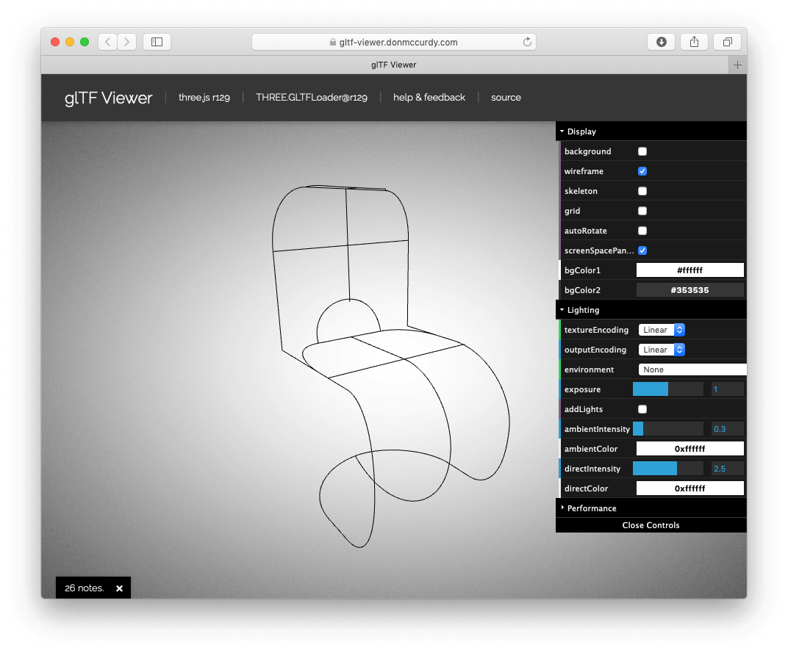
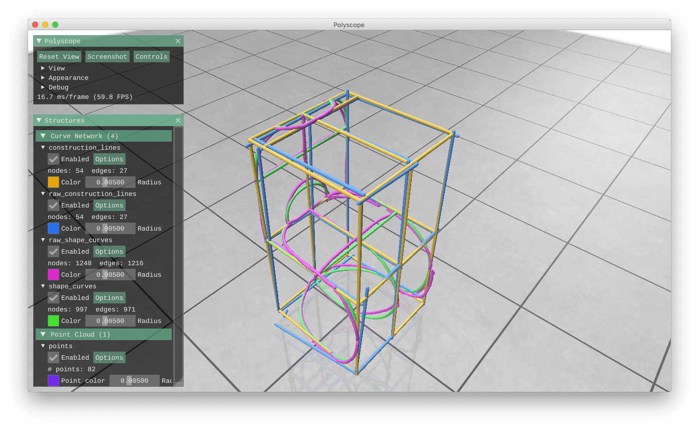

# ScaffoldSketch

- [paper](https://cragl.cs.gmu.edu/scaffoldsketch/ScaffoldSketch-%20Accurate%20Industrial%20Design%20Drawing%20in%20VR%20[Xue%20Yu,%20Stephen%20DiVerdi,%20Akshay%20Sharma,%20Yotam%20Gingold%202021%20UIST].pdf)
- [project page](https://cragl.cs.gmu.edu/scaffoldsketch/)

## Setup the Project

We use [Poetry](https://python-poetry.org) to manage the dependencies(see [pyproject.toml](pyproject.toml)):

- `poetry shell` 
- `python3 app.py -h` 

parameters:

- `-dummy` : Disable auto-correct
- `--load-state` : load existing json file

Or you can install the dependencies manually and run with the command.

examples:

```
python3 app.py
python3 app.py --dummy
python3 app.py --load-state ../user_study/P2/P2_open.json
```


## How to Run

read [How to Run](instruction/How_to_Run.md).


## Viewing output


The are two exported files: `timestamp.gltf` and `timestamp.json`.

### gltf


GLTF files can be viewed use [glTF Viewer](https://gltf-viewer.donmccurdy.com), to get the best view results, you may need to set the options as the image below.




### json


Json files can be viewed use the `vis_json.py` script, you can click to show or hide the corresponding components.  

  


## Miscellaneous


### Casting

cast screen to Chrome: [Casting](https://www.oculus.com/casting/)

Or use [scrcpy](https://github.com/Genymobile/)

```
scrcpy -c 1200:800:180:320 -m 1600 -b 25M
```

install scrcpy


```
brew cask install android-platform-tools
brew install scrcpy
```
